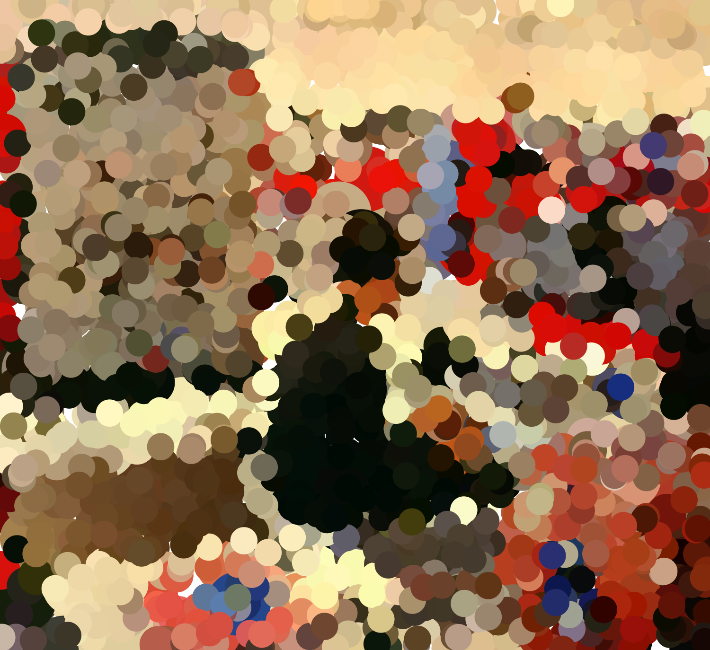

# Cours Processing B1 Ynov Bordeaux
*du 2 mars au 9 mai 2023*


#### Sketches en ligne
✍️ https://editor.p5js.org/v3ga/collections/0chtGIgKA

#### Google Sheets pour les rendus
✍️ https://docs.google.com/spreadsheets/d/1o2iodrZ1eRMqgRZ5F2kOGk0EFqyRkUmMwBsui-VPnLk/

#### Visualisation de l'exécution d'un programme p5.js
:male_detective: https://v3ga.net/p5LearnableProgramming/index_U2_L2_lines.php<br />
C'est un projet expérimental pour montrer l'exécution pas à pas d'un programme sur quelques commandes de dessin. Utilisez la liste pour accéder aux différents exemples.


## Thème
Au croisement du design graphique et de la programmation, ces cours proposeront d’utiliser l'environnement [Processing](https://processingfoundation.org/) dans sa version web [p5.js](https://p5js.org/) pour créer, générer des formes géométriques afin de les imprimer à l’aide d’un [robot traceur](https://www.axidraw.com/) dans la lignée des pionniers de l'art génératif.
Le projet final de ces cours mettra en œuvre ces techniques de programmation et l'utilisation du traceur pour produire des cartes de visites génératives. 

## Objectifs pédagogiques
* découverte de l'histoire de l'art génératif et plus largement du design génératif, évolutions des années 60 à nous jours.
* découverte de la programmation interactive temps réel, productions de visuels animés réagissant à des stimuli : mouvement(s), voix, ... 
* apprendre et maîtriser les concepts fondamentaux de la programmation : variables, boucles, branchements, fonctions. 
* apprendre à développer ses propres outils de création, création d'interface (UI) pour configurer et explorer les potentialités d'algorithmes de créations de formes graphiques.
* insérer ses productions de formes dans un workflow plus général : print, site web, installations interactives.

### Déroulé d'un cours  
Le cours sera consacré au deux tiers à l'étude théorique de concepts de programmation créative avec des références graphiques artistiques et l'autre tiers à la pratique par la réalisation d'un exercice « à chaud » utilisant les notions vues.

### Barême pour les exercices
Pour les exercices que je vous donne, le barême est le suivant (sur 10)
* **rendu en temps et en heure** :point_right: 1 point.
* **respect de la consigne** :point_right: 3 points. 
Le sketch doit être sauvegardé sur votre compte en ligne, l'addresse (URL) doit être insérée dans la colonne correspondante dans [le document Google Sheet](https://docs.google.com/spreadsheets/d/1o2iodrZ1eRMqgRZ5F2kOGk0EFqyRkUmMwBsui-VPnLk/). 
* **créativité** :point_right: 6 points. 
J'entends par créativité une recherche graphique personelle et/ou interactive qui peut se faire à partir de sketches vus en classe ou de références que vous trouvez en ligne.

## Cours 01
*Jeudi 2 mars 2023*

### Introduction
* Présentation du travail de Julien Gachadoat.
* Présentation de l'environnement [Processing](http://www.processing.org) et de son « écosystème » (notamment [p5.js](https://p5js.org/))
* Présentation de l'environnement de développement et premières commandes de dessin dans l'éditeur en ligne [editor.p5js.org/](https://editor.p5js.org/) 

### Dessiner avec du code 
* repère de dessin, espace de dessin [p5js / createCanvas](https://p5js.org/reference/#/p5/createCanvas)
* dessin de formes géométriques : [point](https://processing.org/reference/point_.html), [line](https://p5js.org/reference/#/p5/line), [ellipse](https://p5js.org/reference/#/p5/ellipse), [rect](https://p5js.org/reference/#/p5/rect).
* dessin de formes géométriques « composées » : [beginShape](https://p5js.org/reference/#/p5/beginShape) / [vertex](https://p5js.org/reference/#/p5/vertex) / [endShape](https://p5js.org/reference/#/p5/endShape)
* gestion des couleurs ([color](https://p5js.org/reference/#/p5/color)) et des options de dessin([stroke](https://p5js.org/reference/#/p5/stroke), [noStroke](https://p5js.org/reference/#/p5/noStroke), [fill](https://p5js.org/reference/#/p5/fill), [noFill](https://p5js.org/reference/#/p5/noFill), [strokeWeight](https://p5js.org/reference/#/p5/strokeWeight))
* exporter / faire une capture d'écran avec la fonction [p5js / save](https://p5js.org/reference/#/p5/save)

### Références
* [A Modern Prometheus — The history of Processing by C.Reas & B.Fry](https://medium.com/processing-foundation/a-modern-prometheus-59aed94abe85)
* [Welcome to Processing](https://vimeo.com/140600280), vidéo en anglais par [Dan Shiffman](http://shiffman.net/) pour [la fondation Processing](https://processingfoundation.org/).
* [Design by Numbers](https://dbn.media.mit.edu/) de [John Maeda](https://maedastudio.com/)
* [Ben Fry](https://www.benfry.com/) and [Casey Reas](http://reas.com/)
* [Rune Madsen / Computational color](http://printingcode.runemadsen.com/lecture-color/)

#### Exercice
Choisir une des œuvres [« Homages to the square »](https://www.google.fr/search?q=Josef+albers+square&sxsrf=AJOqlzXDonDyiy1zWyFfiJG2-z_exlfBGA:1677769320061&source=lnms&tbm=isch&sa=X&ved=2ahUKEwj0_tjiwb39AhWwVaQEHe5MD3wQ_AUoAXoECAEQAw&biw=1298&bih=898&dpr=1) de Josef Albers pour le récréer avec du code.


## Cours 02
*Jeudi 9 mars 2023*

### Dessiner avec du code (bis)
* retour sur les notions vus au cours 01 avec le dessin d'un visage de Bruno Munari. Nous introduirons à ce sujet la notion de **variable** que nous reverrons dans le cours 03.

Bruno Munari est un artiste plasticien italien. Peintre, sculpteur, dessinateur, designer, il est également auteur et illustrateur de livres pour enfants (source : [wikipedia](https://fr.wikipedia.org/wiki/Bruno_Munari))


### Animer
* Animer : 
  * avec une fonction génératrice de nombre aléatoires : [random](https://p5js.org/reference/#/p5/random)  
  * avec la variable de temps [frameCount](https://p5js.org/reference/#/p5/frameCount) et la fonction [millis()](https://p5js.org/reference/#/p5/millis)
  * avec les variables [mouseX](https://p5js.org/reference/#/p5/mouseX) et [mouseY](https://p5js.org/reference/#/p5/mouseY) pour capter la position de la souris dans le canvas.

#### Exercice à rendre
Créez un visage dans le style de Bruno Munari en utilisant des formes géométriques.
Ajouter un élément d’interactivité en utilisant [la position de la souris](https://p5js.org/reference/#/p5/mouseX) ou la fonction [random](https://p5js.org/reference/#/p5/random). Le visage se dessinera sur un canvas de dimensions (500,500) pixels, les couleurs à utiliser sont le noir et le blanc uniquement. 

L'exercice sera à rendre pour le **jeudi 23 mars** au plus tard, l'addresse du sketch est à placer dans la colonne correspondante sur le document en ligne [Google Sheets](https://docs.google.com/spreadsheets/d/1o2iodrZ1eRMqgRZ5F2kOGk0EFqyRkUmMwBsui-VPnLk/)

## Cours 03
*mardi 11 avril 2023*

### Introduction à la notion de [variable](https://p5js.org/reference/#/p5/let)
* variables prédéfinies vues dans les cours précédents : mouseX / mouseY, width / height, frameCount.
* création / utilisation d'une variable dans un sketch simple. 
* Variable pour la gestion d'un media : 
  * Chargement et affichage d'une image, gestionnaire [preload()](https://p5js.org/reference/#/p5/preload)
  * Utiliser la fonction [imageMode()](https://p5js.org/reference/#/p5/imageMode) pour changer l'origine du dessin de l'image.
  * utilisation des informations de couleurs pour générer une composition : effet de « pointillisme ».



### Structure de branchement [if-else](https://p5js.org/reference/#/p5/if-else)
* exemple avec affichage d’un objet en fonction de la position de la souris.
* Modélisation d'un objet (bille), rebond sur les bords de l'écran.


#### Exercice à faire en cours
* reprendre le sketch de dessin avec la souris ( https://editor.p5js.org/v3ga/sketches/-TrdeNAX9 )
* remplacer le dessin du cercle par le dessin d'un motif de votre composition. Plusieurs opérations à faire : 
  * dupliquer [le sketch d'exemple](https://editor.p5js.org/v3ga/sketches/-TrdeNAX9) pour le sauver dans votre sketchbook.
  * créer la variable associée à l'image.
  * charger l'image dans en utilisant le gestionnaire [preload()](https://p5js.org/reference/#/p5/preload). 

#### Exemples
* [Takawo / 230320_15minCoding](https://editor.p5js.org/takawo/sketches/xWNhr-9Bg) 

## Cours 04
*jeudi 4 mai 2023*

### Révision de la structure [if-else](https://p5js.org/reference/#/p5/if-else)
* exemple de partition de l'espace et opérateurs logiques.
### Introduction à la notion de [boucle](https://p5js.org/reference/#/p5/for)
* répétition d’un élément graphique de façon « naïve ».
* utilisation d'une boucle pour réaliser le même sketch. 
* création d'une double boucles imbriquées : pavage de du canvas avec un motif, modulation de la taille des motifs en fonction de la souris et du temps.
* Utilisation de cette grille pour reprogrammer une œuvre de [Vera Molnar](http://www.veramolnar.com/) : [Quatre éléments ditribués au hasard (1959)](https://www.centrepompidou.fr/fr/ressources/oeuvre/cez6op)

<a href="https://www.centrepompidou.fr/fr/ressources/oeuvre/cez6op" target="_blank"></a><br>

### Préparation du projet final
* préparation du sketch pour l'impression avec plotter d'une carte de visite au format *80 x 55 mm*
 
#### Références 
* [Grilles de truchet (images)](https://www.qwant.com/?client=brz-brave&t=images&q=truchet+grille&o=0%3AC9C8648332497AA6B9189484BAF8D6733465D4F4)
* [Jean-Noël Lafargue - L'improvisateur de tissus (1871)](https://hyperbate.fr/dernier/?p=42335)<br />*Le 28 juillet 1871, face à l’Académie d’Amiens, l’ingénieur textile Édouard Gand a présenté ses travaux sur ce que l’on peut considérer comme un des tout premiers exemples — sinon le premier exemple véritable — de design génératif mécanique.*
* [Guillaume Pelletier-Auger - Les pavages de Truchet](https://pelletierauger.com/fr/projets/les-pavages-de-truchet.html)<br />*Errances dans les mathématiques françaises du XVIIIe siècle.*

## Cours 05
*mardi 9 mai*

### Template pour les cartes de visite
Nous allons travailler aujourd'hui avec un canvas dont la taille est proportionnelle à la taille de la carte de visite que nous allons imprimer ( 80 x 50 mm ). Nous allons travailler avec une bibliothèque externe qui va nous permettre d'exporter notre dessin non plus à un format image mais à un format vectoriel ( [format SVG](https://fr.wikipedia.org/wiki/Scalable_Vector_Graphics) ).
Nous allons utiliser deux variable **widthCard** et **heightCard** qui vont respectivement représenter la largeur et la hauteur de notre carte. Comme nous travaillons en pixels, nous devons mettre à  l'échelle pour que les dimensions à l'écran ne soient pas trop petites. Pour cela nous utilisons la variable **s** (pour *scale* = mise à l'échelle)

```javascript
createCanvas(widthCard*s,heightCard*s,SVG); // notez le troisième paramètre SVG
```

À partir de ce cours, vous travaillerez en *dupliquant* ce sketch : https://editor.p5js.org/v3ga/sketches/dLcxRCEFe

### Exemple "Quatre éléments" avec export SVG
✍️ https://editor.p5js.org/v3ga/sketches/2aliwVF_y

### Exemple "Arcs Truchet" avec export SVG
✍️ https://editor.p5js.org/v3ga/sketches/Sh0OgoeS5

### Template pour la grille de motifs
✍️ https://editor.p5js.org/v3ga/sketches/ormNS3fC9 

### Transformations
Nous allons apprendre à générer des formes composées à partir d’une forme simple qui sera dupliquée et transformée. Pour cela nous allons exploiter les fonctions de transformations du repère ([translate](https://p5js.org/reference/#/p5/translate), [rotate](https://p5js.org/reference/#/p5/rotate), [scale](https://p5js.org/reference/#/p5/scale)), combinées avec la structure de boucle que nous avons vus la semaine passée.
Nous en profiterons pour revoir les boucles pour combiner répétitions et transformations.


#### Références "spirographes"
* [John Whitney — Catalog (1961)](https://www.youtube.com/watch?v=TbV7loKp69s)
 
### Interface graphique (UI)
Nous apprendrons aussi à relier une variable à un élément d'interface graphique (UI = user interface) pour explorer plus facilement les potentialités de notre algorithme en modifiant la valeur de variables grâce à des [sliders](https://p5js.org/reference/#/p5/createSlider) ou en déclanchant des actions avec des [boutons](https://p5js.org/reference/#/p5/createButton)

## Cours 06 | Cours 07
*mercredi 17 mai*


Nous allons consacrer la journée à la préparation des motifs / patterns pour l'impression avec le traceur [axidraw](https://www.axidraw.com/). L'objectif sera d'avoir imprimé en fin de journée au moins deux cartes de visite pour chacun, je ferai la découpe pour la semaine prochaine. Attention, il va falloir rajouter ce bout de code pour exporter à la bonne taille physique de 80x50mm.

### Un peu de code 

```javascript
// ------------------------------------
function beginExport()
{
  let svg = document.getElementsByTagName("svg")[0];
  svg.setAttribute("width", `${widthCard}mm`);
  svg.setAttribute("height", `${heightCard}mm`);
}

// ------------------------------------
function endExport()
{
  let svg = document.getElementsByTagName("svg")[0];
  svg.setAttribute("width", `${width}`);
  svg.setAttribute("height", `${height}`);
}
```

Et modifier en conséquence notre fonction **exporter()** comme suit : 

```javascript
function exporter()
{
  beginExport();
  save(`carte_grille_80x50mm_${name}.svg`);
  endExport();
}
```

### Typographie
Nous allons utiliser la fonte **"Relief-SingleLine"** pour utiliser du texte avec le traceur :   
* https://github.com/isdat-type/Relief-SingleLine


Vous devez installer la fonte **outline_otf/ReliefSingleLineOutline-Regular.otf**. 

### Composition
L'idée est de créer le recto pour afficher vos informations, au minimum le nom et le prénom et un moyen de vous contacter (numéro de téléphone, e-mail ou site web par exemple)

Sur Illustrator, vous pouvez créer un document de 80x55mm. 
Au moment de l'export au format SVG, il est impératif d'utiliser "Vectoriser" pour la police de caractères.


## ⚠️ Projet ⚠️
À préparer pour le **mercredi 17 mai** impérativement.
Le travail est à faire par binôme ou seul. Pour les binômes, merci de colorer les cellules correspondant à vos noms dans [le document Google Sheet](https://docs.google.com/spreadsheets/d/1o2iodrZ1eRMqgRZ5F2kOGk0EFqyRkUmMwBsui-VPnLk/). 
Partir du sketch https://editor.p5js.org/v3ga/sketches/ormNS3fC9 et imaginer au moins quatre motifs qui se combinent en utilisant uniquement des dessins avec des "lignes" (line, arc, bezier, triangle, etc ... avec *noFill()*)

#### Références "grilles de motifs"
* [Making Truchet Tiles in p5.js](https://www.youtube.com/watch?v=99Hr8lpWWSg)
* [Anna Carreras / Trosset](https://www.artblocks.io/project/147)
* [Collection des L2 Design Arts Bordeaux Montaigne (2021)](https://editor.p5js.org/v3ga/collections/ZUiEWFocJ)
* [Collection des L2 Design Arts Bordeaux Montaigne (2022)](https://editor.p5js.org/v3ga/collections/pROfwp32m)
* [Grilles de truchet (images)](https://www.qwant.com/?client=brz-brave&t=images&q=truchet+grille&o=0%3AC9C8648332497AA6B9189484BAF8D6733465D4F4)
* [Multiscale Truchet Patterns with Processing](https://github.com/ciaron/multiscale-truchet)


